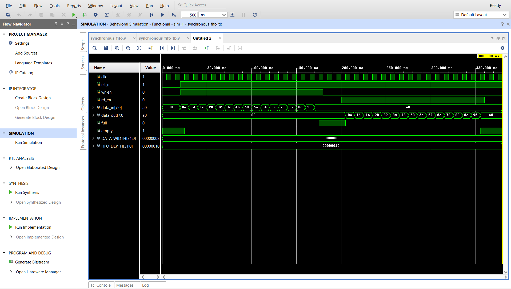

# Synchronous FIFO Design using Verilog HDL

## 📌 Project Overview

This project implements a parameterized Synchronous FIFO (First-In-First-Out) memory using Verilog HDL.

A FIFO stores data such that the first data written into the memory is the first data read from it.

The design uses a single synchronous clock for both read and write operations.

## ⚙️ Specifications

| Parameter | Value |
|-----------|-------|
| Data Width | 8 bits |
| FIFO Depth | 16 |
| Clock | Single synchronous clock |
| Reset | Active-Low |
| Read Operation | Supported |
| Write Operation | Supported |
| Full Flag | Supported |
| Empty Flag | Supported |

## ✨ Features

- Parameterized FIFO design
- 8-bit data width
- 16-depth memory
- Synchronous read and write operations
- Active-low reset
- Full and Empty status flags
- FIFO ordering verification
- Behavioral simulation using Vivado

## 🏗️ FIFO Architecture

The FIFO consists of:

- FIFO memory
- Write pointer
- Read pointer
- Data counter
- Full flag
- Empty flag
- Read and write control logic

## 🔄 Working Principle

### Write Operation

When `wr_en` is high and the FIFO is not full, input data is stored in the FIFO memory and the write pointer is incremented.

### Read Operation

When `rd_en` is high and the FIFO is not empty, data is read from the FIFO memory and the read pointer is incremented.

### Full Condition

The `full` flag becomes high when all 16 FIFO locations are occupied.

### Empty Condition

The `empty` flag becomes high when there is no data available in the FIFO.

## 🧪 Verification

The design was verified using a Verilog testbench in Xilinx Vivado 2020.2.

The testbench verifies:

- Reset operation
- Write operation
- Read operation
- FIFO ordering
- Full condition
- Empty condition

### Test Data

The following 16 values were written into the FIFO:

`10, 20, 30, 40, 50, 60, 70, 80, 90, 100, 110, 120, 130, 140, 150, 160`

The values were successfully read in the same First-In-First-Out order.

## 📊 Simulation Result

The simulation confirms that:

- FIFO becomes `FULL` after 16 successful writes.
- Data is read in First-In-First-Out order.
- FIFO becomes `EMPTY` after all stored data is read.



## 🛠️ Tools Used

- Verilog HDL
- Xilinx Vivado 2020.2
- Behavioral Simulation

## 📂 Project Structure

```text
Synchronous-FIFO/
│
├── src/
│   └── synchronous_fifo.v
│
├── tb/
│   └── synchronous_fifo_tb.v
│
├── simulation/
│   └── waveform.png
│
├── .gitignore
├── LICENSE
└── README.md
